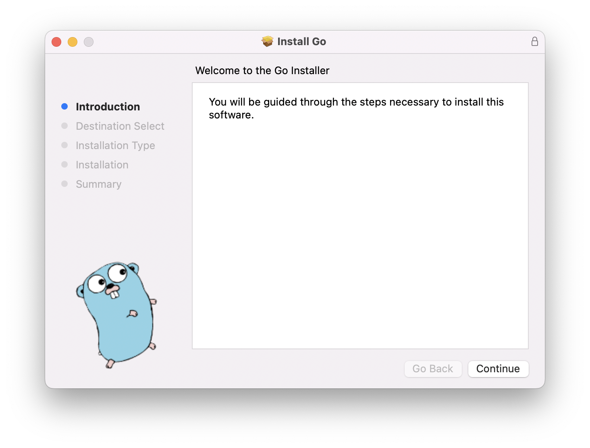
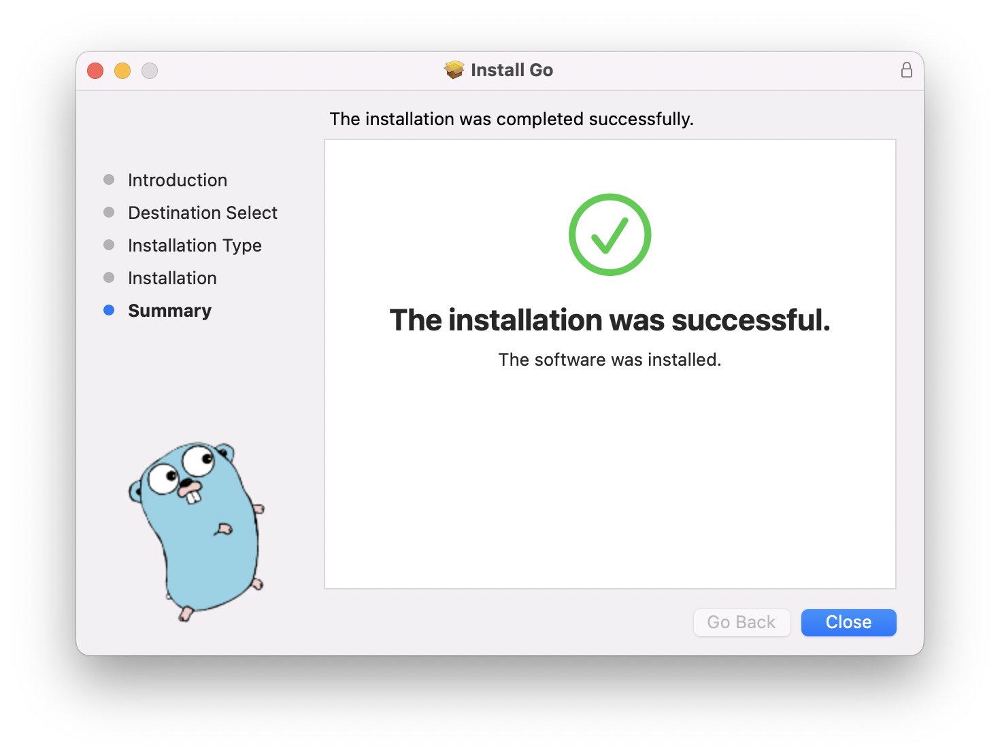
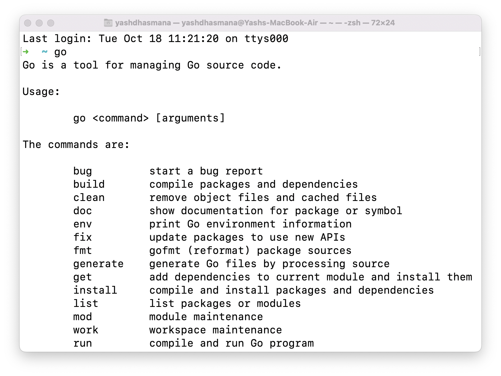

# Introduction

GO Programming Language or GO Lang was developed by Google in 2006 and Open-Sourced in 2009.

It is a statically typed, compiled language that has vast applications in the cloud native space. It is a backend / server-side language.

## Why need a new Language 🤔?

Go was designed keeping in mind the evolving infrastructure

* cloud Infrastructure changed a lot
    
* multi-core processors became common
    
* big networked computational clusters
    
* scalable and distributed
    
* more capacity
    

While other existing languages could not fully take advantage of this, GO came to the rescue. GO was designed to run on multiple cores and built to support concurrency.

**Concurrency -** Doing multiple tasks at the same time

Example - "Watching a video on YouTube while also subscribing, commenting, and liking other comments" **or** "editing a word document online with 2 of your friends at the same time"

## Main Use Cases of Go 🙄

* for performant applications
    
* running on scaled distributed systems
    

## Characteristics of Go 🧐

* simple and readable syntax of a dynamically typed language like Python
    
* efficiency and safety of a lower-level statically typed language like C++
    
* used in server-side or backend
    
    * microservices
        
    * database services
        
    * web applications
        
    * etc.
        

Also, some of the most popular technologies in the Cloud-Native Space like **Docker 🐳** and **Kubernetes ⎈** are written in GO.

 
 

## Installing GO

Download your platform-specific binary from - https://go.dev/dl/ and install it.

To verify the installation, go to your terminal and type and enter "go".

You should see an output if the installation was done correctly.

 
 
 
 