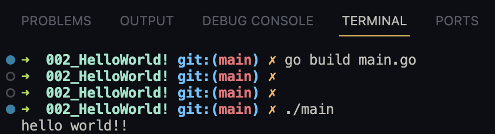

# Hello World !

Writing your first Golang program

* create a folder in which you will keep your code
* create a file named **main.go**
* in golang we have to first initilaize our project. To do so, open your integrated terminal in VS Code and use the command - 

```plaintetxt
go mod init <module-name>     # it will create a file named go.mod
```                 
```go
go mod init hello
```

* **go mod init** is like giving your Go project a name and setting up a system to keep track of the tools (packages) you use. it's like creating a checklist for your project and is mandatory. it makes it easier to build and manage your code.


<br>

* code - 

```go
package main

import "fmt"

func main() {
	fmt.Print("Hello World")

}
```

* all our code must belong to a package (main).

* When you declare package main in a Go source file, you are telling the Go compiler that this package contains the entry point for your program. In other words, it's the starting point for the execution of your program. The main package must always have a main function, which serves as the entry point.

* The **package main** also tells the Go compiler that the package should compile as an executable program instead of a shared library. This means that when you build your Go program, it generates an executable binary file that can be run directly by the operating system.

* The distinction between package main and other packages is significant because in Go, packages can also be compiled into shared libraries (also known as packages or modules) that can be imported and used in other Go programs. However, a package with package main is not meant to be imported as a library. it's meant to be run as a standalone program.

* for one go application/program, you can have only one main function as it is the entrypoint to your code

* The **"fmt"** package provides various functions for formatted input and output. It's a core package in Go and is often used for debugging and displaying information to the console. It has a print function that is used to display the output to the console. (just like python, java and other programming languages have their respective print statements)
    
* running your GO Code
    
```plaintext
go run filename.go
```      
```go
go run main.go
```


* This go file can also be compiled into a standalone binary file which can be run on any system without the need of any external dependencies. To do so, use the command - 

```plaintext
go build filename.go
```
```go
go build main.go
```
* To run this binary file, use the command - 

```plaintext
./filename
```
```bash
./main
```


<br>

Congratulations🎉, you have just written your first Golang program and learned a bit about the language.
