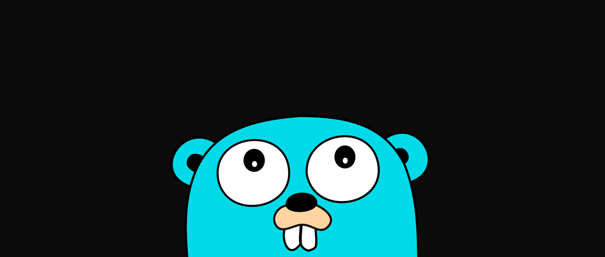

# GO Programming Language 

GO Programming Language or GO Lang was developed by Google in 2006 and Open-Sourced in 2009.

It is a statically typed, compiled language that has vast applications in the backend / server-side.

This repository contains all of my code, practise programs and notes i made while learning Go.

 
 